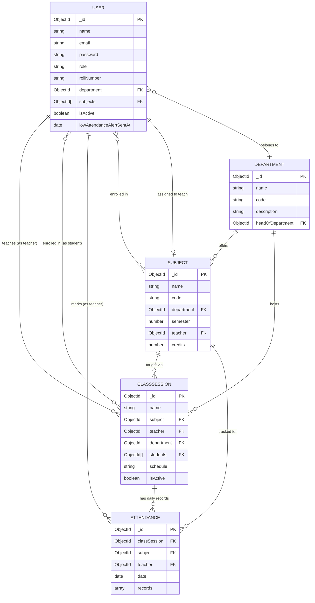

# Entity-Relationship Diagram

This document contains the ER diagram for the Attendance Management System in
Mermaid syntax. Paste it into [mermaid.live](https://mermaid.live) to render,
or view it directly on GitHub (which renders Mermaid blocks natively).

## Notes on the schema design

- **`ATTENDANCE.records`** is an embedded array (`{ student, status, remarks }`)
  rather than one document per student per day. This keeps one document per
  class-session-per-date, which is far cheaper to write and query in MongoDB
  than thousands of single-student documents.
- **`USER`** is a single collection with a `role` discriminator
  (`admin` / `teacher` / `student`) rather than three separate collections.
  Role-specific fields (`rollNumber`, `subjects`) are simply unused/null for
  roles that don't need them — this is idiomatic for MongoDB's flexible schema
  and avoids complex polymorphic joins.
- **`CLASSSESSION`** represents a teacher-created class/section (e.g. "CSE-3A"
  studying "Data Structures"). It is the join point between a `SUBJECT`, a
  `TEACHER`, and a roster of `STUDENT`s — attendance is always marked against
  a `CLASSSESSION` + date.
- A compound unique index on `ATTENDANCE (classSession, date)` prevents
  duplicate attendance records for the same class on the same day; marking
  attendance again for that day **upserts** the existing record instead of
  creating a duplicate.
